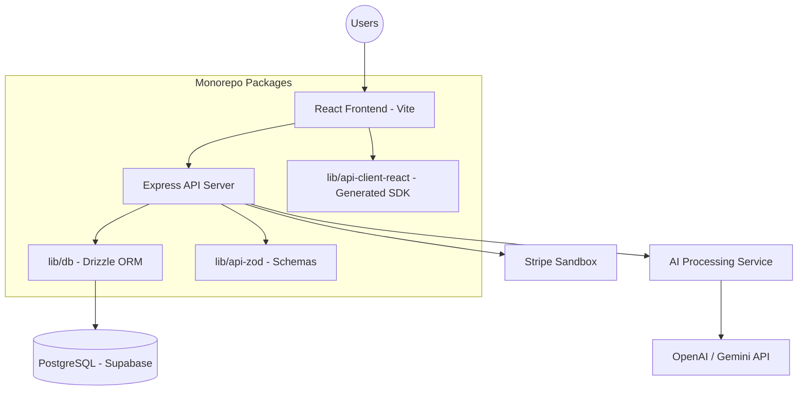

# 🚀 HireLoop — End-to-End Campus Recruitment Portal
(#26ENHL3: Problem Statement 3)

HireLoop is a full-stack **AI-powered campus placement management platform** designed to streamline recruitment workflows between **students, recruiters, and college placement cells**.

The platform digitizes the entire placement lifecycle — from resume creation and job applications to AI interview preparation and placement analytics — within a single professional monorepo ecosystem.

---
## Team Details:
**Name**: Universe of Innovation

| Member | Role |
|------|----------------------|
| **Shubham Verma** | Frontend Development |
| **Shristi Choudhary** | Backend, AI Integrations, Database Architecture |

---
## 📌 Table of Contents

- [Overview](#-overview)
- [Key Features](#-key-features)
- [User Roles](#-user-roles)
- [AI Capabilities](#-ai-capabilities)
- [Tech Stack](#-tech-stack)
- [System Architecture](#-system-architecture)
- [Installation](#-installation)
- [Environment Variables](#-environment-variables)
- [Project Structure](#-project-structure)
- [API Modules](#-api-modules)
- [Future Enhancements](#-future-enhancements)

---

## 🧠 Overview

**HireLoop** connects the three critical stakeholders in campus hiring:

- 🎓 **Students** preparing for placements and seeking opportunities.
- 🏢 **Recruiters** seeking top talent with streamlined filtering.
- 🏫 **Placement Cells** (Admin) managing recruiter approvals and tracking performance.

The platform distinguishes itself by embedding **AI-driven intelligence** into the workflow, providing students with feedback tools that mirror real-world interview and screening processes.

---

## ✨ Key Features

### 👩‍🎓 Student Portal
- **Advanced Profile Management**: Track placement status and readiness.
- **AI Resume Insights**: Get ATS scores and keyword gap analysis.
- **AI Mock Interviews**: Realistic interview simulations with bot feedback.
- **Smart Job Board**: Filter jobs by branch, type, and salary.
- **Success Tracking**: Real-time status updates from "Applied" to "Offer".
- **Premium Upgrades**: Unlock unlimited AI interview sessions via a sandbox payment gateway.

### 🏢 Recruiter Portal
- **Streamlined Job Posting**: Post campus-specific jobs with CGPA and branch filters.
- **AI Smart Shortlist**: Let AI rank candidates based on their skill match for a specific JD.
- **Applicant Pipeline**: Manage candidates through Shortlist, Interview, and Offer stages.
- **Interview Scheduling**: Integrated scheduling tools with automated notification logic.
- **Listing Management**: One-time listing fee (Sandbox) to ensure high-quality campus postings.

### 🏫 Placement Cell Dashboard
- **Recruiter Governance**: Review and approve company registrations.
- **Placement Analytics**: Monitor placement rates, highest packages, and branch-wise trends.
- **Announcement Board**: Broadcast urgent updates to students and recruiters.
- **Data Reports**: Generate comprehensive CSV/PDF reports on placement performance.

---

## 🤖 AI Capabilities

- **Resume ATS Analysis**: Scoring based on industry standard extraction.
- **Smart Shortlisting**: Semantic matching between candidate profiles and job descriptions.
- **AI Interview Bot**: Real-time speech-to-text or text-based interview simulations with scoring.
- **Interview Feedback**: Granular breakdowns of communication and technical strengths/weaknesses.

---

## 🛠 Tech Stack

| Layer | Technology |
|------|------------|
| **Frontend** | React + Vite |
| **Styling** | Vanilla CSS + Framer Motion |
| **State Management** | TanStack Query v5 |
| **Backend** | Node.js + Express |
| **Database** | PostgreSQL + Drizzle ORM (Supabase) |
| **Monorepo Tools** | pnpm Workspaces |
| **API Client** | Orval (Generated TypeScript SDK) |
| **Authentication** | JWT + Role-based Guards |

---

## 🏗 System Architecture



---

## ⚙️ Installation

### 1️⃣ Prerequisites
- **Node.js**: v20 or higher
- **pnpm**: v9 or higher

### 2️⃣ Clone and Install
```bash
git clone https://github.com/ShristiC7/HireLoop.git
cd HireLoop
pnpm install
```

### 3️⃣ Local Development
Run all services simultaneously:
```bash
pnpm run dev
```
*   **Frontend**: `http://localhost:5173`
*   **Backend**: `http://localhost:3001`

---

## 🔐 Environment Variables

Create a `.env` file in the root directory (and relevant package directories):

```bash
# Database
DATABASE_URL=your_supabase_postgres_url

# Security
JWT_SECRET=your_jwt_secret

# AI
OPENAI_API_KEY=your_key_for_resume_analysis

# Payments (Sandbox)
STRIPE_SECRET_KEY=sk_test_...

# URLs
FRONTEND_URL=http://localhost:5173
```

---

## 📁 Project Structure (Monorepo)

```text
HireLoop/
├── artifacts/
│   ├── hireloop/           # React Frontend (Vite)
│   └── api-server/         # Express Backend Server
├── lib/
│   ├── db/                 # Shared Database Layer (Schematic/Drizzle)
│   ├── api-zod/            # Shared Data Schemas (Zod)
│   └── api-client-react/   # Generated React Hooks for API
├── pnpm-workspace.yaml     # Workspace Configuration
└── package.json            # Root Scripts (build, dev, typecheck)
```

---

## 🔌 API Modules

- **Authentication**: JWT-based onboarding with role verification.
- **Profiles**: Profile management for Students and Recruiters.
- **Jobs**: Posting, filtering, and listing operations.
- **Applications**: Full lifecycle tracking (applied, shortlisted, etc.).
- **AI Tools**: Resume parsing and Mock Interview generation.
- **Payments**: Stripe Checkout integration for listings and premium access.
- **Admin**: Strategic insights and recruiter approval workflows.

---

## 🌐 Live Deployment

🚀 **HireLoop**: [https://hireloop-gyzl.onrender.com/](https://hireloop-gyzl.onrender.com/)  


---

## 🚀 Future Enhancements

- **Video Analysis**: Using AI to analyze behavioral cues during interviews.
- **Real-Time Notifications**: WebSocket-based alerts for shortlist updates.
- **Skill Gap Prediction**: Personalized learning paths based on failed interviews.
- **Campus Multi-Tenancy**: Support for multiple colleges within one platform.
